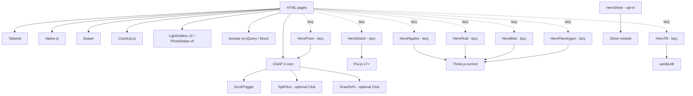

# Infinito — Animation & Effects Audit

> Structured inventory of every animation, effect, and interactive system in the Infinito legacy template, with a viability assessment and a concrete preservation/replacement plan for each.
>
> Companion to **[`MODERNIZATION_PLAN.md`](MODERNIZATION_PLAN.md)**.
>
> This audit covers the first two steps of the [rebuild methodology](REBUILD_METHODOLOGY.md): **"What it does"** = understand; **"Viable today?" / "Tier"** = evaluate. The remaining steps (pin as a test contract, build implementation-blind, verify) happen per-feature when it enters its phase — see [`REBUILD_METHODOLOGY.md`](REBUILD_METHODOLOGY.md).

---

## Tier definitions

| Tier                           | Meaning                                                                                        |
| ------------------------------ | ---------------------------------------------------------------------------------------------- |
| **T1 — Must preserve**         | Core to the product's identity and commercial value. Reimplement faithfully on a modern stack. |
| **T2 — Preserve but simplify** | Strong idea, dated implementation. Keep the visual outcome, modernize the code.                |
| **T3 — Optional**              | Useful but non-essential. Ship as opt-in modules, not bundled by default.                      |
| **T4 — Remove**                | Dormant, redundant, or replaced by native browser features. Drop with rationale.               |

---

## 0. Implementation Status (Phase 1A)

> Last updated: **2026-04-20**. Scope of this section: what is actually shipped under `rebuild/`, mapped back to the audit. Companion to [`MODERNIZATION_PLAN.md` §1.5](MODERNIZATION_PLAN.md#15-implementation-progress-live).

### 0.1 Modern animation API

All scroll-triggered behavior in the rebuild flows through one module: **[`rebuild/src/lib/animations.ts`](rebuild/src/lib/animations.ts)**. Components opt in with `data-anim="<name>"` plus optional `data-anim-delay`, `data-anim-strength`, `data-anim-direction` attributes. Boot is wired in `BaseLayout.astro`:

- `<html>` gets the class `has-anim` only when `prefers-reduced-motion: no-preference`.
- `global.css` ships visibility fallbacks so reduced-motion users (and JS-off users) always see all content.
- After mount, `mount()` walks `[data-anim]` and registers the matching ScrollTrigger.

### 0.2 Primitives — current vs. target

| Primitive            | DOM hook                                     | Implements legacy                                                              | Status                                                                                                                                                                                                                    |
| -------------------- | -------------------------------------------- | ------------------------------------------------------------------------------ | ------------------------------------------------------------------------------------------------------------------------------------------------------------------------------------------------------------------------- |
| `mountIntro()`       | `[data-intro]` on `<html>` + child marks     | `slide-up-intro`, `fade-up-intro`, `fade-down-intro`, `hero_img-intro`         | ✅ Live. One-shot timeline on `window.load`, no scroll trigger.                                                                                                                                                           |
| `registerSlideUp`    | `data-anim="slide-up"`                       | `slide-up`, `slide-up__el`, `slide-up__lines`, `slide-up2`, `slide-up2__lines` | ✅ Live. Stagger via `data-anim-delay`. Lines split deferred until SplitText is licensed (Phase 1B).                                                                                                                      |
| `registerFadeUp`     | `data-anim="fade-up"`, `data-anim="fade-in"` | `fade-up`, `fade-up__el`, `fade-in`, `fade-in__el`                             | ✅ Live. `fade-in` variant skips the y-translate.                                                                                                                                                                         |
| `registerRotateIn`   | `data-anim="rotate-in"`                      | `rotate-in`, `rotate-in__el`                                                   | ✅ Live. Scale 0.8 + opacity 0 → 1.                                                                                                                                                                                       |
| `registerParallaxBg` | `data-anim="parallax-bg"`                    | `.parallax` + `.parallax__el` background-position scroll                       | ✅ Live. Used by `VideoStrip`. Strength via `data-anim-strength`.                                                                                                                                                         |
| `registerParallaxY`  | `data-anim="parallax-y"`                     | (new — fills the missing vertical parallax slot)                               | ✅ Live. Strength via `data-anim-strength` (px), direction via `data-anim-direction="up\|down"`. Used by `Featured` images + numerals.                                                                                    |
| `registerOdometer`   | `data-anim="odometer"`                       | `js-odometer--simple`                                                          | ✅ Live. Counts to `data-number-end`. The "999999 → ~1 Million+" string-swap behaviour is **deferred** (Phase 1B).                                                                                                        |
| `registerSvgDraw`    | `data-anim="svg-draw"`                       | `svg-draw`, `svg-draw__el`, `svg-draw--filled`                                 | ✅ Live. GSAP **DrawSVG** (free since 2025) draws Service icons; opt-in `data-anim-fill` draws the outline then fades the fill for filled glyphs — used by the Featured numerals (`NumeralGlyph.astro`). Testimonials quote-mark watermark still pending. |
| `registerCoverDR`    | `data-anim="cover-d-r-img"`                  | `cover-d-r-img`, `cover-d-r-img__el`                                           | ✅ Live (Phase 1B). Horizontal `clip-path: inset()` wipe + content scale/shift settle. Used by `Featured` images. No overlay divs — clip-path replaces the legacy approach.                                               |
| `registerCoverUp`    | `data-anim="cover-up"`                       | `cover-up`, `cover-up__el`, `cover-transp` line reveals                        | ✅ Live (Phase 1B). Vertical `clip-path: inset()` wipe (bottom → top). Used by `BlogPreview` cards. `cover-transp` text line reveals still deferred (depends on SplitText / line splitter).                                |
| `registerBars`       | `data-anim="bars"`                           | `bounty.js` skill bars                                                         | ❌ Deferred — only blog/about pages need it (Phase 1B).                                                                                                                                                                   |

### 0.3 Interactive components — current state

| Component / behavior          | Implementation in `rebuild/`                                                                                                                                                                          | Notes vs. legacy                                                                                                                                 |
| ----------------------------- | ----------------------------------------------------------------------------------------------------------------------------------------------------------------------------------------------------- | ------------------------------------------------------------------------------------------------------------------------------------------------ |
| Nav drawer + search overlay   | `Nav.astro` — Alpine `x-data` shared between header/drawer/search; opacity+visibility transitions; body scroll lock; ESC to close; staggered link entry.                                              | Drawer hoisted **outside** `<header>` to avoid stacking-context bugs (the header is `z-[60]`, drawer `z-[55]`, search `z-[65]`).                 |
| Loading screen                | `LoadingScreen.astro` — fades out on `window.load`.                                                                                                                                                   | The legacy stroke-draw on the "infinito" wordmark is deferred to Phase 1B (needs `svg-draw` for filled paths).                                   |
| Portfolio filter grid         | `Portfolio.astro` — Alpine `matches()` filter, 12-column grid with `auto-rows-[260\|300px]` and `grid-auto-flow: dense`, `x-transition` opacity.                                                      | Replaces Isotope masonry. AJAX load-more deferred. Lightbox deferred (links open in new tab).                                                    |
| Process timeline (carousel)   | `ProcessCarousel.astro` — Alpine state, dot+label wrapped in a single `<button>` for full click target, progress line evenly distributed across dots with px offsets so it terminates inside the dot. | Replaces `owl-carousel`. No swipe gesture yet — Phase 1B will swap to Swiper.                                                                    |
| Testimonials carousel         | `Testimonials.astro` — Alpine fade carousel.                                                                                                                                                          | Replaces `master-slider`. Swiper migration is Phase 1B.                                                                                          |
| Pricing monthly/yearly toggle | `Pricing.astro` — Alpine `billing` state, two stacked `<span>`s in a 1×1 grid with scale+fade `x-transition`.                                                                                         | Replaces the legacy show/hide swap; the odometer count-up on yearly prices is deferred (Phase 1B; needs `registerOdometer` re-trigger on click). |
| VideoStrip lightbox           | `VideoStrip.astro` — `<button>` opens a fixed-position iframe modal; `toEmbed()` converts Vimeo/YouTube watch URLs to embed URLs; ESC + backdrop click + body scroll lock.                            | Replaces the LightGallery video popup. Real LightGallery v2 is Phase 1B if buyers want gallery features.                                         |
| Contact map                   | `Contact.astro` — Google Maps no-API embed iframe (`maps.google.com/maps?q=...&output=embed`) with an "Open in Google Maps" overlay button.                                                           | Replaces the keyed Google Maps JS API integration. No API key required; styling is limited to CSS filters (`grayscale-[0.2] contrast-95`).       |
| Subscribe + Contact forms     | Wired to Formspree via `import.meta.env.PUBLIC_FORMSPREE_ENDPOINT`.                                                                                                                                   | Replaces Mailchimp/PHP mailer. Inline notice when the env var is unset.                                                                          |

### 0.4 Reduced motion

`prefers-reduced-motion: reduce` is honored globally:

```ts
// rebuild/src/layouts/BaseLayout.astro
if (matchMedia("(prefers-reduced-motion: no-preference)").matches) {
  document.documentElement.classList.add("has-anim");
}
```

```css
/* rebuild/src/styles/global.css */
html:not(.has-anim) [data-anim] {
  opacity: 1 !important;
  transform: none !important;
}
```

When `has-anim` is absent, the `mount()` function in `animations.ts` early-returns and ScrollTriggers are never created. This satisfies the constraint in [§15](#15-performance--accessibility-constraints) for every primitive shipped in Phase 1A.

---

## 1. Hero / Intro Effects

### 1.1 Liquid Distortion (Pixi.js slideshow)

| Field                  | Value                                                                                                                                                                                                               |
| ---------------------- | ------------------------------------------------------------------------------------------------------------------------------------------------------------------------------------------------------------------- |
| **What it does**       | Full-screen image slideshow with a WebGL displacement-map shader that morphs slides with a fluid, liquid-metal transition.                                                                                          |
| **Where it appears**   | `Final_Files/index__04--distort.html`, plus 5 standalone demos in `Final_Files/plugins/LiquidDistortion/index*.html`                                                                                                |
| **Powered by**         | Pixi.js v3-era + custom `CanvasSlideshow` class in `Final_Files/plugins/LiquidDistortion/js/main.js`                                                                                                                |
| **Viable today?**      | The visual is timeless and unique on Envato; the implementation needs porting (Pixi has had several breaking releases).                                                                                             |
| **Tier**               | **T1 — Must preserve**                                                                                                                                                                                              |
| **Modern replacement** | Port `CanvasSlideshow` to **Pixi.js v7+**. Alternative: rebuild on **`ogl`** (smaller, modern WebGL micro-library) if Pixi's footprint is excessive. Keep the displacement-map asset and slide image API identical. |

### 1.2 WebGL Ripples Hero

| Field                  | Value                                                                                                                                                                                                                                                                   |
| ---------------------- | ----------------------------------------------------------------------------------------------------------------------------------------------------------------------------------------------------------------------------------------------------------------------- |
| **What it does**       | Mouse-reactive WebGL surface (water-ripple / fluid distortion) sitting behind the hero text; recolors via `data-color` attribute.                                                                                                                                       |
| **Where it appears**   | `Final_Files/index__12--ripples.html` and `index__12--ripples--02..06.html`                                                                                                                                                                                             |
| **Powered by**         | Three.js r84 (CDN) + custom shader in `Final_Files/js/plugins/ripples.js` + perlin noise + bundled React production build (used incidentally by the page)                                                                                                               |
| **Viable today?**      | Yes; the effect is highly differentiating. The React dep is incidental and removable.                                                                                                                                                                                   |
| **Tier**               | **T1 — Must preserve**                                                                                                                                                                                                                                                  |
| **Modern replacement** | Port shader to **current Three.js (r150+)**. Drop React. Wrap as a single-file lazy-loaded component (`HeroRipples`). Replace the 5 sub-variant HTML files with **one demo + a runtime palette switcher** driven by CSS custom properties + the `data-color` attribute. |

### 1.3 Fluid Scroll Displacement (`HeaderScroller`)

| Field                  | Value                                                                                                                                                                                                      |
| ---------------------- | ---------------------------------------------------------------------------------------------------------------------------------------------------------------------------------------------------------- |
| **What it does**       | Scroll-driven WebGL displacement on the hero image (logo + dot assets participate in the shader). The hero warps as the user scrolls.                                                                      |
| **Where it appears**   | `Final_Files/index__03--fluid.html`                                                                                                                                                                        |
| **Powered by**         | Custom `Final_Files/plugins/Shtick/HeaderScroller.js` (no npm package; named after the asset folder)                                                                                                       |
| **Viable today?**      | Yes; the scroll-distortion effect remains rare and desirable.                                                                                                                                              |
| **Tier**               | **T1 — Must preserve**                                                                                                                                                                                     |
| **Modern replacement** | Reimplement against current Three.js. Treat the existing JS as the spec and rebuild against the visual outcome. Hook into **GSAP ScrollTrigger** for scroll progress instead of a bespoke scroll listener. |

### 1.4 3D Tilt Parallax

| Field                  | Value                                                                                                               |
| ---------------------- | ------------------------------------------------------------------------------------------------------------------- |
| **What it does**       | A hero image is split into stacked layers that tilt and parallax in 3D following the cursor (Codrops-style).        |
| **Where it appears**   | `Final_Files/index__06--tilt.html`                                                                                  |
| **Powered by**         | `Final_Files/js/plugins/tiltfx.js` (Codrops, MIT)                                                                   |
| **Viable today?**      | Yes. The library still works; modern alternatives are smaller and maintained.                                       |
| **Tier**               | **T1 — Must preserve**                                                                                              |
| **Modern replacement** | **`vanilla-tilt.js`** (MIT, ~5KB, actively maintained). Preserve the multi-layer `data-tilt-options` JSON contract. |

### 1.5 Three.js "Blub-Cloudy" Blob

| Field                  | Value                                                                                                                                    |
| ---------------------- | ---------------------------------------------------------------------------------------------------------------------------------------- |
| **What it does**       | Organic 3D blob with cloudy/perlin distortion behind the hero, paired with a rotating headline.                                          |
| **Where it appears**   | `Final_Files/index__09--mslider-text.html`                                                                                               |
| **Powered by**         | Three.js r84 + OrbitControls + perlin shader; `blub_cloudy()` in `Final_Files/js/scripts.js` (~line 1366+)                               |
| **Viable today?**      | Visual still feels premium; tech is years out of date.                                                                                   |
| **Tier**               | **T2 — Preserve but simplify**                                                                                                           |
| **Modern replacement** | Port to current Three.js. Use `three/examples/jsm/controls/OrbitControls.js`. Simplify the shader pipeline. Lazy-load only on this demo. |

### 1.6 Three.js Planetygon (Wireframe Globe)

| Field                  | Value                                                                                                    |
| ---------------------- | -------------------------------------------------------------------------------------------------------- |
| **What it does**       | Wireframe globe of animated triangular segments with a foggy 3D scene.                                   |
| **Where it appears**   | `Final_Files/index__10--planetygon.html`                                                                 |
| **Powered by**         | Three.js r84 + custom geometry code in `Final_Files/js/scripts.js` (~line 1433+); animated with TweenMax |
| **Viable today?**      | Yes; niche but visually compelling for tech/agency pitches.                                              |
| **Tier**               | **T2 — Preserve but simplify**                                                                           |
| **Modern replacement** | Port to current Three.js. Replace TweenMax point animation with GSAP 3 timelines. Lazy-load.             |

### 1.7 Prism Slider

| Field                  | Value                                                                                                                                              |
| ---------------------- | -------------------------------------------------------------------------------------------------------------------------------------------------- |
| **What it does**       | Image-to-image transitions through animated SVG masks shaped like prisms / diamonds.                                                               |
| **Where it appears**   | `Final_Files/index__11--prism-slider.html`                                                                                                         |
| **Powered by**         | Custom `Final_Files/js/plugins/PrismSlider.js` + `PrismSlider-init.js` + `js/utils/rAF.js` + `js/utils/easing.js` + bundled React production build |
| **Viable today?**      | Yes; the React dependency is gratuitous and should be removed.                                                                                     |
| **Tier**               | **T2 — Preserve but simplify**                                                                                                                     |
| **Modern replacement** | Drop React. Rewrite as a vanilla module (~200 lines). Use GSAP for the mask animation. Cache mask SVGs on init.                                    |

### 1.8 Shine.js + Granim Animated Gradient Hero

| Field                  | Value                                                                                                                                                                                                                                                                                                                                             |
| ---------------------- | ------------------------------------------------------------------------------------------------------------------------------------------------------------------------------------------------------------------------------------------------------------------------------------------------------------------------------------------------- |
| **What it does**       | An animated multi-stop gradient canvas (Granim) sits behind the hero; the headline text gets a moving specular "shine" highlight that follows the cursor (Shine.js).                                                                                                                                                                              |
| **Where it appears**   | `Final_Files/index__05--shinejs.html`                                                                                                                                                                                                                                                                                                             |
| **Powered by**         | `Final_Files/js/plugins/shine.min.js` (Shine.js) + `Final_Files/js/plugins/granim.min.js` (Granim)                                                                                                                                                                                                                                                |
| **Viable today?**      | The Granim effect can be replaced by a CSS conic/linear gradient animation in most cases. Shine.js is a niche text effect with no modern equivalent — preserve as opt-in.                                                                                                                                                                         |
| **Tier**               | **T2 — Preserve but simplify** (Granim) / **T3 — Optional** (Shine.js)                                                                                                                                                                                                                                                                            |
| **Modern replacement** | **Granim:** replace with CSS-animated gradient (`background: linear-gradient(...); background-size: 200% 200%; animation: gradient-shift ...`) for the common case; keep canvas version available for buyers who want exact parity. **Shine.js:** keep as a small opt-in module; alternative: use CSS `background-clip: text` + an animated mask. |

### 1.9 Video Background + Lettering Text Rotator

| Field                  | Value                                                                                                                                                                            |
| ---------------------- | -------------------------------------------------------------------------------------------------------------------------------------------------------------------------------- |
| **What it does**       | Looping video background under a hero with word-level animated rotating headline text.                                                                                           |
| **Where it appears**   | `Final_Files/index__02--video-text-rotator.html`                                                                                                                                 |
| **Powered by**         | `Final_Files/js/plugins/jquery.vide.min.js` for the video background; `lettering_rotator()` in `scripts.js` (~line 7442+) using Lettering.js + TweenMax                          |
| **Viable today?**      | Yes; native `<video>` makes Vide unnecessary.                                                                                                                                    |
| **Tier**               | **T1 — Must preserve** (rotator)                                                                                                                                                 |
| **Modern replacement** | **Video:** native `<video autoplay muted loop playsinline>` with a poster fallback. **Rotator:** GSAP **SplitText** (or a 30-line vanilla split-by-word helper) + GSAP timeline. |

### 1.10 Mouse-Parallax Light Hero

| Field                  | Value                                                                                                                                                                                          |
| ---------------------- | ---------------------------------------------------------------------------------------------------------------------------------------------------------------------------------------------- |
| **What it does**       | Light-themed hero with stacked background layers that move on mouse hover; intro zoom on the background.                                                                                       |
| **Where it appears**   | `Final_Files/index__13--white-hero.html`                                                                                                                                                       |
| **Powered by**         | `move_hover` helpers in `Final_Files/js/scripts.js` (~line 7616+); shared parallax classes (`.background-interactive`, `.js-backgound-move-hover`)                                             |
| **Viable today?**      | Yes; the technique is a few lines of JS.                                                                                                                                                       |
| **Tier**               | **T1 — Must preserve**                                                                                                                                                                         |
| **Modern replacement** | ~50 lines of vanilla JS: track `mousemove`, `requestAnimationFrame`-throttled CSS transform updates on layered elements with `data-parallax-depth` attributes. Honor `prefers-reduced-motion`. |

### 1.11 Cinemagraph Hero

| Field                  | Value                                                                                                                    |
| ---------------------- | ------------------------------------------------------------------------------------------------------------------------ |
| **What it does**       | A slider whose slides are looping cinemagraph GIFs (mostly-still images with one moving region).                         |
| **Where it appears**   | `Final_Files/index__08--mslider-cinematograph.html`                                                                      |
| **Powered by**         | MasterSlider for the slider chrome; the GIF assets supply the motion                                                     |
| **Viable today?**      | Yes; this is just a slider with media-rich slides.                                                                       |
| **Tier**               | **T3 — Optional** (fold into unified slider component)                                                                   |
| **Modern replacement** | Swiper. Replace GIFs with MP4/WebM video for ~10–20× smaller file size and better quality. Provide GIF fallback in docs. |

### 1.12 Standard Image Slider Hero

| Field                  | Value                                                                                                                                    |
| ---------------------- | ---------------------------------------------------------------------------------------------------------------------------------------- |
| **What it does**       | Generic full-bleed image slider hero with autoplay and dots.                                                                             |
| **Where it appears**   | `Final_Files/index__07--mslider.html` (and inside many other demos)                                                                      |
| **Powered by**         | MasterSlider                                                                                                                             |
| **Viable today?**      | Yes, but MasterSlider is heavy and proprietary.                                                                                          |
| **Tier**               | **T2 — Preserve but simplify**                                                                                                           |
| **Modern replacement** | **Swiper** (MIT, modern, single library covers this + testimonials + logos + cinemagraph). One slider library across the entire product. |

---

## 2. Slider Systems (Non-Hero)

### 2.1 MasterSlider (everywhere)

| Field                  | Value                                                                                                                                                    |
| ---------------------- | -------------------------------------------------------------------------------------------------------------------------------------------------------- |
| **What it does**       | Powers hero sliders, full-screen project galleries (`project-01.html`), portfolio image sliders, and testimonial quotes (`slider-quotes`) on most demos. |
| **Powered by**         | `Final_Files/plugins/masterslider/` (proprietary library, multiple skins)                                                                                |
| **Tier**               | **T2 — Preserve but simplify**                                                                                                                           |
| **Modern replacement** | **Swiper**. Has parity for every current use: fade transitions, parallax, autoplay, thumbnails, fullscreen, coverflow. MIT-licensed.                     |

### 2.2 Owl Carousel

| Field                  | Value                                                                                        |
| ---------------------- | -------------------------------------------------------------------------------------------- |
| **What it does**       | Powers `slider-quotes` testimonials, `#process` step slider, `owl_logos` client logo strips. |
| **Powered by**         | `Final_Files/plugins/OwlCarousel/`                                                           |
| **Tier**               | **T2 — Preserve but simplify**                                                               |
| **Modern replacement** | **Swiper** (consolidate to one slider library across the product).                           |

### 2.3 Prism Slider

Documented in §1.7 above.

---

## 3. Scroll-Driven Animations

### 3.1 ScrollMagic + GSAP scenes

| Field                  | Value                                                                                                                                                                                                                                                                                                                   |
| ---------------------- | ----------------------------------------------------------------------------------------------------------------------------------------------------------------------------------------------------------------------------------------------------------------------------------------------------------------------- |
| **What it does**       | The bulk of the product's "scroll feel": parallax sections, fade-in/slide-up reveals, cover/double-cover image animations, SVG draw-on, animated number odometers, animated progress bars, hero parallax, fixed elements, blur text reveals.                                                                            |
| **Where it appears**   | Most multi-section demos and inner pages (`project-*.html`, `blog-*.html`, all home demos using `.slide-up`, `.fade-in`, `.svg-draw`, `.parallax`, `.js-odometer`, etc.)                                                                                                                                                |
| **Powered by**         | ScrollMagic + TweenMax + TimelineMax + DrawSVG; orchestration in `Final_Files/js/scripts.js` (~lines 4022–5795)                                                                                                                                                                                                         |
| **Viable today?**      | The visual outcomes are as relevant as ever; ScrollMagic is no longer maintained and TweenMax has been superseded by GSAP 3.                                                                                                                                                                                            |
| **Tier**               | **T1 — Must preserve** (the outcomes); **T4 — Remove** (the libraries)                                                                                                                                                                                                                                                  |
| **Modern replacement** | **GSAP 3 + ScrollTrigger.** Single library replaces ScrollMagic + TweenMax + TimelineMax + TimelineLite. Build a small set of reusable scroll-trigger primitives (`slide-up`, `fade-in`, `cover`, `double-cover`, `parallax`, `svg-draw`, `odometer`, `bars`) as data-attribute-driven directives or Alpine components. |

### 3.2 SmoothScroll (wheel smoothing)

| Field                  | Value                                                                                                                                             |
| ---------------------- | ------------------------------------------------------------------------------------------------------------------------------------------------- |
| **What it does**       | Softer mouse-wheel scrolling on supported browsers.                                                                                               |
| **Powered by**         | SmoothScroll.js inside `Final_Files/js/plugins.min.js`                                                                                            |
| **Viable today?**      | No. Modern browsers + `scroll-behavior: smooth` cover the simple case; aggressive wheel smoothing now hurts UX, accessibility, and trackpad feel. |
| **Tier**               | **T4 — Remove**                                                                                                                                   |
| **Modern replacement** | None by default. Buyers who want momentum scrolling can opt into **Lenis** (modern, well-maintained). Document the integration.                   |

### 3.3 Velocity.js

| Field            | Value                                                                                                                           |
| ---------------- | ------------------------------------------------------------------------------------------------------------------------------- |
| **What it does** | A jQuery animation accelerator; **present in `Final_Files/js/libs/velocity.min.js` but unreferenced anywhere in the codebase**. |
| **Tier**         | **T4 — Remove**                                                                                                                 |

---

## 4. Text Effects

### 4.1 Lettering.js — letter / word splitting

| Field                  | Value                                                                                                                                 |
| ---------------------- | ------------------------------------------------------------------------------------------------------------------------------------- |
| **What it does**       | Splits text into letter/word/line spans so each can be animated independently.                                                        |
| **Where it appears**   | Hero text rotators (`index__02`), button shuffle/hover effects, odometer letter animations                                            |
| **Powered by**         | `Final_Files/js/plugins/lettering.js` (jQuery plugin)                                                                                 |
| **Tier**               | **T1 — Must preserve** (functionality)                                                                                                |
| **Modern replacement** | **GSAP SplitText** (Club GreenSock; commercial license) or a tiny vanilla split-text helper (~30 lines) for buyers without GSAP Club. |

### 4.2 Hero text rotator (`lettering_rotator`)

| Field                  | Value                                                                                        |
| ---------------------- | -------------------------------------------------------------------------------------------- |
| **What it does**       | Rotates through a stack of headline lines with letter-by-letter motion.                      |
| **Where it appears**   | `index__02--video-text-rotator.html`                                                         |
| **Powered by**         | `lettering_rotator()` in `Final_Files/js/scripts.js` (~line 7442+) — Lettering.js + TweenMax |
| **Tier**               | **T1 — Must preserve**                                                                       |
| **Modern replacement** | Rebuild as `TextRotator` component using GSAP 3 + SplitText. Honor `prefers-reduced-motion`. |

### 4.3 Codyhouse-style word rotator (`.cd-headline`)

| Field                  | Value                                                                                                                          |
| ---------------------- | ------------------------------------------------------------------------------------------------------------------------------ |
| **What it does**       | Inline rotating words inside a fixed headline (e.g. "I am Passionate / Minimalist / Impeccable / Adventurer").                 |
| **Where it appears**   | `index__09--mslider-text.html`; markup `.cd-headline.letters.rotate-3`                                                         |
| **Powered by**         | jQuery code in `scripts.js` (~line 1030+) + CSS keyframes for `.cd-words-wrapper` in `scss/module/_modules.scss` (~line 7862+) |
| **Tier**               | **T1 — Must preserve**                                                                                                         |
| **Modern replacement** | Vanilla JS rotator (~50 lines) + CSS animations. Same data attributes, no jQuery.                                              |

### 4.4 Shuffle-letters button hover

| Field                  | Value                                                                                            |
| ---------------------- | ------------------------------------------------------------------------------------------------ |
| **What it does**       | On hover, button text characters shuffle to random glyphs and resolve back to the original word. |
| **Where it appears**   | Buttons with `.btn--shuffle`                                                                     |
| **Powered by**         | Custom `$.fn.shuffleLetters` IIFE inside `animated_words()` in `scripts.js` (~lines 2055–2208)   |
| **Tier**               | **T2 — Preserve but simplify**                                                                   |
| **Modern replacement** | Vanilla port (~80 lines), no jQuery dependency. Same data-attribute API.                         |

### 4.5 Glitch canvas effect

| Field                | Value                                                                                                                 |
| -------------------- | --------------------------------------------------------------------------------------------------------------------- |
| **What it does**     | Canvas-based glitch effect on `.glitch-image` elements.                                                               |
| **Where it appears** | **Nowhere** — `glitch()` is defined in `scripts.js` but no HTML in the repository uses `.glitch-image`. Dormant code. |
| **Tier**             | **T4 — Remove**                                                                                                       |

---

## 5. Portfolio System

### 5.1 Isotope filtering + masonry

| Field                  | Value                                                                                                                                                       |
| ---------------------- | ----------------------------------------------------------------------------------------------------------------------------------------------------------- |
| **What it does**       | Asymmetric masonry grid for portfolio and blog, with category filter buttons and animated re-layout.                                                        |
| **Where it appears**   | All portfolio sections, `blog.html`, `blog-2.html`, `projects-02.html`                                                                                      |
| **Powered by**         | Isotope (`isotope.pkgd.min.js`) + custom `$.fn.isotope__fade_in_out` extension in `scripts.js` (~line 3770+) + keyframes in `scss/module/portfolio.scss`    |
| **Viable today?**      | Yes; Isotope still works. **Muuri** is a modern alternative with smoother animations and no jQuery.                                                         |
| **Tier**               | **T1 — Must preserve**                                                                                                                                      |
| **Modern replacement** | Either keep Isotope (drop jQuery via the standalone build) or migrate to **Muuri**. Reimplement the fade-in/fade-out filter transition with GSAP timelines. |

### 5.2 AJAX "load more" portfolio

| Field                  | Value                                                                                                                                                                                                                                                             |
| ---------------------- | ----------------------------------------------------------------------------------------------------------------------------------------------------------------------------------------------------------------------------------------------------------------- |
| **What it does**       | Clicking "Load More" fetches an HTML fragment, appends new portfolio items to the grid, re-runs Isotope and LightGallery.                                                                                                                                         |
| **Where it appears**   | Portfolio sections on most demos; `data-appn` attribute points to fragments under `Final_Files/portfolio__ajax-els/...` (20 fragment files)                                                                                                                       |
| **Powered by**         | `load_more()` in `scripts.js` (~lines 3475–3764)                                                                                                                                                                                                                  |
| **Tier**               | **T2 — Preserve but simplify**                                                                                                                                                                                                                                    |
| **Modern replacement** | Keep the UX; replace the implementation with `fetch()` + `IntersectionObserver` (auto-load on scroll, optional). Replace 20 separate HTML fragments with a single component fed from a JSON content source (or Astro/Vite-generated fragments from one template). |

### 5.3 LightGallery (lightbox)

| Field                  | Value                                                                                                                          |
| ---------------------- | ------------------------------------------------------------------------------------------------------------------------------ |
| **What it does**       | Lightbox for portfolio images and embedded videos.                                                                             |
| **Where it appears**   | All portfolio sections; `.js-lightgallery`, `.js-lightgallery-video`                                                           |
| **Powered by**         | `Final_Files/plugins/lightGallery/` (v1.x)                                                                                     |
| **Viable today?**      | Yes. LightGallery v2.x is actively maintained, no jQuery dependency, modern API.                                               |
| **Tier**               | **T1 — Must preserve**                                                                                                         |
| **Modern replacement** | **LightGallery v2.x** (commercial license required for distribution — verify, or replace with **PhotoSwipe v5** which is MIT). |

### 5.4 Direction-aware hover (`jquery.entry`)

| Field                  | Value                                                                                                                       |
| ---------------------- | --------------------------------------------------------------------------------------------------------------------------- |
| **What it does**       | Detects which edge the cursor entered/exited an element from, so the hover overlay can slide in from the correct direction. |
| **Where it appears**   | Portfolio hover overlays in `scripts.js` (~line 1833+)                                                                      |
| **Powered by**         | `Final_Files/js/plugins/jquery.entry.js`                                                                                    |
| **Tier**               | **T1 — Must preserve**                                                                                                      |
| **Modern replacement** | ~30 lines of vanilla JS: compare cursor position to element bounding rect to determine entry edge.                          |

---

## 6. Loaders & Intros

### 6.1 SVG draw-on intro / loading screen

| Field                  | Value                                                                                                                                       |
| ---------------------- | ------------------------------------------------------------------------------------------------------------------------------------------- |
| **What it does**       | An animated SVG logo draws itself in on page load; the loader fades to reveal the page. Uses GSAP DrawSVG-style stroke animation.           |
| **Where it appears**   | `#loading-screen`, `.loader`, `.infinito__loader`; styles in `scss/theme/_intro.scss` and `scss/module/_modules.scss`                       |
| **Powered by**         | TweenMax + classes like `svg-draw-intro`; orchestrated in `loading_anim()` in `scripts.js` (~lines 6732–7371)                               |
| **Tier**               | **T1 — Must preserve**                                                                                                                      |
| **Modern replacement** | GSAP 3 + **DrawSVG** (now free since GSAP went 100% free in April 2025 — no Club license needed). Already wired in `registerSvgDraw`; trigger on `DOMContentLoaded`. |

### 6.2 Pace.js progress bar

| Field                  | Value                                                                                                                                                                |
| ---------------------- | -------------------------------------------------------------------------------------------------------------------------------------------------------------------- |
| **What it does**       | Top-of-page progress bar that estimates page-load completion.                                                                                                        |
| **Where it appears**   | Loaded only on `Final_Files/index.html`; other demos reference `#pace-local-styles` but don't load Pace                                                              |
| **Powered by**         | `Final_Files/js/plugins/pace.min.js`                                                                                                                                 |
| **Viable today?**      | Modern performance practice favors progressive rendering and skeleton states over full-page progress bars. The legacy implementation is also inconsistently applied. |
| **Tier**               | **T4 — Remove**                                                                                                                                                      |
| **Modern replacement** | Replace with the GSAP intro timeline above, triggered on `load`. Buyers who want a Pace-style bar can integrate **NProgress** (lightweight, MIT) — document it.      |

---

## 7. Forms

### 7.1 Floating-label inputs

| Field                  | Value                                                                            |
| ---------------------- | -------------------------------------------------------------------------------- |
| **What it does**       | Form labels float above the input on focus / when the field has content.         |
| **Where it appears**   | All contact and subscribe forms; `.form-style--02`, `.form-style--03`            |
| **Powered by**         | `active_form_focus()` in `scripts.js` (~line 6707+)                              |
| **Tier**               | **T1 — Must preserve**                                                           |
| **Modern replacement** | CSS-only solution using `:placeholder-shown` and `:focus`. Drop the JS entirely. |

### 7.2 AJAX form submission

| Field                  | Value                                                                                                                                                                                                      |
| ---------------------- | ---------------------------------------------------------------------------------------------------------------------------------------------------------------------------------------------------------- |
| **What it does**       | Intercepts `.contact-form` and `.subscribe-form` submits, posts via jQuery AJAX (or JSONP for MailChimp), shows loading state on `.btn--ajax`.                                                             |
| **Powered by**         | `submit_form()`, `submit_form_custom()` in `scripts.js` (~lines 6456+); backend is `Final_Files/mailer.php` (raw `mail()`) or MailChimp `post-json`                                                        |
| **Viable today?**      | The pattern is fine; jQuery AJAX, raw PHP `mail()`, and JSONP are all dated.                                                                                                                               |
| **Tier**               | **T2 — Preserve but simplify**                                                                                                                                                                             |
| **Modern replacement** | Native `fetch()`. Default backend: **Formspree** (handles spam, no signup required to receive). Documented alternatives: **Netlify Forms**, **Web3Forms**, and a hardened `mailer.php` for legacy hosting. |

---

## 8. Navigation Behaviors

### 8.1 Slide-out / panel nav

| Field                  | Value                                                                                             |
| ---------------------- | ------------------------------------------------------------------------------------------------- |
| **What it does**       | Hamburger toggles a full-screen or side-panel navigation with animated reveal of menu items.      |
| **Where it appears**   | All pages                                                                                         |
| **Powered by**         | `nav_opened`, `nav_closed`, `toggle_nav` in `scripts.js` (~lines 2586–2674) using TimelineMax     |
| **Tier**               | **T1 — Must preserve**                                                                            |
| **Modern replacement** | Alpine.js component + GSAP 3 timeline. Honor focus trapping and ESC key (currently inconsistent). |

### 8.2 Nav fade / elastic / hover-bg-flow

| Field                  | Value                                                                                                                                           |
| ---------------------- | ----------------------------------------------------------------------------------------------------------------------------------------------- |
| **What it does**       | Nav-link hover effects: a colored background sweeps in (`hover--bg-flow`), elastic underlines (`nav--elastic`), fade backgrounds (`nav--fade`). |
| **Powered by**         | `hover_bg_nav()`, `hover_bg_pageContent()` in `scripts.js` (inside `animated_words`, ~lines 2355–2367)                                          |
| **Tier**               | **T2 — Preserve but simplify**                                                                                                                  |
| **Modern replacement** | CSS-only where possible (modern `:hover` with pseudo-elements + `transition`); GSAP for the few cases needing JS-driven sequencing.             |

### 8.3 Magic-line tab indicator (`box_move`)

| Field                  | Value                                                                                                                                      |
| ---------------------- | ------------------------------------------------------------------------------------------------------------------------------------------ |
| **What it does**       | A pill or underline indicator slides between active nav/tab items on hover.                                                                |
| **Where it appears**   | Nav and tab components                                                                                                                     |
| **Powered by**         | `box_move()` in `scripts.js` (~lines 2379–2463)                                                                                            |
| **Tier**               | **T1 — Must preserve**                                                                                                                     |
| **Modern replacement** | Reimplement with FLIP technique (GSAP `Flip` plugin or hand-rolled `getBoundingClientRect` + transform). Common modern pattern, ~60 lines. |

### 8.4 Scroll spy + in-page anchor scroll

| Field                  | Value                                                                                                             |
| ---------------------- | ----------------------------------------------------------------------------------------------------------------- |
| **What it does**       | Highlights the active nav link based on scroll position; smooth-scrolls to anchors on click.                      |
| **Powered by**         | `scroll_spy()`, `inpage_scroll()`, `got_top()` in `scripts.js` (~lines 2697–2844)                                 |
| **Tier**               | **T1 — Must preserve**                                                                                            |
| **Modern replacement** | `IntersectionObserver` for scroll spy. Native `element.scrollIntoView({ behavior: 'smooth' })` for in-page links. |

### 8.5 Nav header fade on scroll

| Field                  | Value                                                                                 |
| ---------------------- | ------------------------------------------------------------------------------------- |
| **What it does**       | Nav becomes opaque/transparent based on scroll direction and position.                |
| **Powered by**         | `nav_header_fade_scroll()` in `scripts.js` (~line 2883+)                              |
| **Tier**               | **T1 — Must preserve**                                                                |
| **Modern replacement** | GSAP ScrollTrigger with `onUpdate` callback, or a small `IntersectionObserver` setup. |

---

## 9. Stats / Numbers

### 9.1 Odometer animated numbers

| Field                  | Value                                                                                                                   |
| ---------------------- | ----------------------------------------------------------------------------------------------------------------------- |
| **What it does**       | Numeric values animate from 0 to target with a slot-machine-style roll.                                                 |
| **Where it appears**   | Stats sections (`.js-odometer`) on most demos, especially `services-*` and `index__09`                                  |
| **Powered by**         | Odometer (`odometer.min.js`) + bounty.js + ScrollMagic trigger + `number_counter` scene in `scripts.js`                 |
| **Tier**               | **T1 — Must preserve**                                                                                                  |
| **Modern replacement** | **CountUp.js** (MIT, ~10KB, no dependencies, easing and formatting built-in). Trigger via GSAP ScrollTrigger `onEnter`. |

### 9.2 Animated horizontal/vertical bars

| Field                  | Value                                                                                                               |
| ---------------------- | ------------------------------------------------------------------------------------------------------------------- |
| **What it does**       | Skill/stat bars fill in from 0 to target percentage when scrolled into view; vertical variant for `bars--vertical`. |
| **Where it appears**   | Stats sections, `services-01.html`                                                                                  |
| **Powered by**         | `linear_bar_draw_animation` ScrollMagic scene in `scripts.js`                                                       |
| **Tier**               | **T1 — Must preserve**                                                                                              |
| **Modern replacement** | CSS `scaleX`/`scaleY` transforms triggered by ScrollTrigger; ~20 lines.                                             |

---

## 10. CSS Animations & Transitions

### 10.1 Recurring CSS animation surface

| Field                  | Value                                                                                                                                                                                                                              |
| ---------------------- | ---------------------------------------------------------------------------------------------------------------------------------------------------------------------------------------------------------------------------------- |
| **Where it lives**     | `scss/module/_modules.scss` (~9,200 lines), `scss/theme/_intro.scss` (~770 lines), `scss/theme/_theme.scss` (~11,150 lines), per-demo `css/theme__index-*.css`                                                                     |
| **What it covers**     | Button hover states, headline reveal animations, cover/mask reveals, isotope fade keyframes, pace-related keyframes, search loading spinners, gradient text, gradient borders, intro text reveal classes                           |
| **Tier**               | **T2 — Preserve but simplify**                                                                                                                                                                                                     |
| **Modern replacement** | Reimplement as Tailwind utilities + a small set of `@keyframes` in a dedicated `animations.css`. The 20k+ lines of legacy SCSS that touch animation will reduce by ~80% under Tailwind because most cases are utility-replaceable. |

---

## 11. Other Effects

### 11.1 Three.js (general)

Used by Ripples (§1.2), Fluid HeaderScroller (§1.3), Blub-Cloudy (§1.5), Planetygon (§1.6). All currently on **r84 from CDN**. **Action:** standardize on a single current Three.js version, lazy-loaded only by demos that need it.

### 11.2 Pixi.js (general)

Used only by Liquid Distortion (§1.1). On **v3-era**. **Action:** port to current Pixi v7+ or replace with `ogl`.

### 11.3 React (incidental)

Bundled `react.production.min.js` is loaded by the Ripples and Prism Slider demo pages but is **not used as a framework** — it is a vestigial dependency of the original implementations. **Action:** drop. Neither effect needs React.

### 11.4 GMaps

`Final_Files/js/plugins/gmaps.min.js` provides Google Maps integration on contact pages. **Tier T2:** replace with **Leaflet** (open source, no API key required) as the default; document the Google Maps integration as an opt-in.

### 11.5 Modernizr

Feature detection. **Tier T4:** modern browsers don't need it; `CSS.supports()` covers the rare case.

### 11.6 FontFaceOnload

Font loading callback. **Tier T4:** replace with native `document.fonts.ready` Promise.

### 11.7 imagesLoaded

Wait-for-images helper used to defer Isotope layout. **Tier T2:** keep if Isotope is kept; replaceable with `Promise.all` over `image.decode()` calls.

### 11.8 jQuery + jQuery Easing + hoverIntent + Enquire.js

All present, all replaceable. **Tier T4:** drop as runtime dependencies. Total replacement code is ~150 lines of vanilla JS across the entire product.

### 11.9 Barba.js (PJAX page transitions)

Referenced in `scripts.js` comments but **never wired in**. **Tier T4:** drop the comments. (Page transitions are a strong v2 add-on but are not currently shipped.)

---

## 12. Summary Matrix

|    # | System                                  | Tier  | Action                                                       |
| ---: | --------------------------------------- | ----- | ------------------------------------------------------------ |
|  1.1 | Liquid Distortion (Pixi)                | T1    | Port to Pixi v7+                                             |
|  1.2 | WebGL Ripples                           | T1    | Port shader to current Three.js; one demo + palette switcher |
|  1.3 | Fluid HeaderScroller                    | T1    | Reimplement on current Three.js                              |
|  1.4 | 3D Tilt                                 | T1    | Replace with vanilla-tilt                                    |
|  1.5 | Three.js Blob                           | T2    | Port to current Three.js, simplify                           |
|  1.6 | Three.js Planetygon                     | T2    | Port to current Three.js                                     |
|  1.7 | Prism Slider                            | T2    | Drop React, vanilla rewrite                                  |
|  1.8 | Shine.js / Granim                       | T2/T3 | CSS gradient default; canvas opt-in                          |
|  1.9 | Video + Text Rotator                    | T1    | Native video + GSAP rotator                                  |
| 1.10 | Mouse-parallax Light Hero               | T1    | Vanilla JS reimplementation                                  |
| 1.11 | Cinemagraph                             | T3    | Fold into Swiper; MP4 instead of GIF                         |
| 1.12 | MasterSlider Hero                       | T2    | Replace with Swiper                                          |
|  2.1 | MasterSlider (general)                  | T2    | Replace with Swiper                                          |
|  2.2 | Owl Carousel                            | T2    | Replace with Swiper                                          |
|  3.1 | ScrollMagic + GSAP scenes               | T1    | Migrate to GSAP 3 + ScrollTrigger                            |
|  3.2 | SmoothScroll                            | T4    | Drop; document Lenis as opt-in                               |
|  3.3 | Velocity.js                             | T4    | Drop (unused)                                                |
|  4.1 | Lettering.js                            | T1    | GSAP SplitText or vanilla helper                             |
|  4.2 | Hero text rotator                       | T1    | Rebuild on GSAP 3                                            |
|  4.3 | `.cd-headline` rotator                  | T1    | Vanilla rewrite                                              |
|  4.4 | Shuffle-letters button                  | T2    | Vanilla rewrite                                              |
|  4.5 | Glitch canvas                           | T4    | Drop (dormant)                                               |
|  5.1 | Isotope masonry                         | T1    | Keep (Isotope no-jQuery) or migrate to Muuri                 |
|  5.2 | AJAX load-more                          | T2    | `fetch` + IntersectionObserver                               |
|  5.3 | LightGallery                            | T1    | Upgrade to v2.x or PhotoSwipe v5                             |
|  5.4 | Direction-aware hover                   | T1    | Vanilla reimplementation                                     |
|  6.1 | SVG draw-on intro                       | T1    | GSAP DrawSVG or CSS dasharray                                |
|  6.2 | Pace.js                                 | T4    | Drop; GSAP intro timeline replaces it                        |
|  7.1 | Floating labels                         | T1    | CSS-only                                                     |
|  7.2 | AJAX form submit                        | T2    | `fetch` + Formspree                                          |
|  8.1 | Slide-out nav                           | T1    | Alpine + GSAP                                                |
|  8.2 | Nav hover effects                       | T2    | CSS-only where possible                                      |
|  8.3 | Magic-line indicator                    | T1    | FLIP technique                                               |
|  8.4 | Scroll spy / anchor scroll              | T1    | IntersectionObserver + native smooth scroll                  |
|  8.5 | Nav fade on scroll                      | T1    | ScrollTrigger                                                |
|  9.1 | Odometer                                | T1    | CountUp.js                                                   |
|  9.2 | Animated bars                           | T1    | CSS transforms + ScrollTrigger                               |
| 10.1 | CSS animation surface                   | T2    | Tailwind utilities + small `animations.css`                  |
| 11.3 | React (incidental)                      | T4    | Drop                                                         |
| 11.4 | GMaps                                   | T2    | Replace with Leaflet                                         |
| 11.5 | Modernizr                               | T4    | Drop                                                         |
| 11.6 | FontFaceOnload                          | T4    | Replace with `document.fonts.ready`                          |
| 11.7 | imagesLoaded                            | T2    | Conditionally keep                                           |
| 11.8 | jQuery / Easing / hoverIntent / Enquire | T4    | Drop                                                         |
| 11.9 | Barba.js                                | T4    | Drop comments                                                |

---

## 13. Dependency Map (Target State)



**Key principle:** Three.js, Pixi.js, and per-demo hero modules are **never in the global bundle**. A buyer building a site from the default `index.html` ships zero WebGL JavaScript.

---

## 14. Migration Priority Order

Execute in this order to minimize risk and surface buyer-visible value early.

1. **GSAP 3 + ScrollTrigger primitives** (Phase 1) — unblocks every other animation.
2. **Component scroll-trigger directives** (`slide-up`, `fade-in`, `cover`, `parallax`, `svg-draw`, `odometer`, `bars`) — needed by every page.
3. **Swiper-based slider component** — replaces MasterSlider + Owl + cinemagraph everywhere.
4. **Isotope/Muuri portfolio + AJAX load-more + LightGallery v2** — needed by all portfolio demos and `blog.html`.
5. **Floating-label form + Formspree submit** — needed by every `services-*` and `contact.html`.
6. **Nav system** (slide-out, scroll spy, hover effects, magic-line, fade-on-scroll) — needed by every page.
7. **Hero effects (Phase 2):** Tilt → Video Rotator → Ripples → Distort → Fluid HeaderScroller (cheapest to most expensive).
8. **Hero effects (Phase 3):** Prism → Blob → Planetygon → Shine/Granim → Light Parallax.
9. **Documentation site** including `prefers-reduced-motion` policy, browser support matrix, and per-effect performance budgets.

---

## 15. Performance & Accessibility Constraints

The original template **fails on both** for modern standards. The rebuild must commit to:

- **`prefers-reduced-motion`** honored by every animation primitive (no exceptions).
- **No WebGL on first paint** for any demo. Every WebGL hero must be lazy-loaded after the page is interactive.
- **Lighthouse mobile score > 90** on every demo.
- **`prefers-color-scheme`** respected where the design allows.
- **Keyboard-navigable** for every interactive element (nav, sliders, lightbox, filters, forms).
- **Focus visible** by default; never `outline: none` without a visible replacement.
- **ARIA labels** on icon-only buttons, sliders, and the lightbox.
- **`aria-live` regions** for AJAX-loaded portfolio content.
- **Memory ceiling:** any WebGL hero must release resources on `pagehide` and provide a `destroy()` method.
- **Static fallbacks:** every WebGL hero must render a usable static image if WebGL is unavailable, the device is low-memory, or the user prefers reduced motion.

These constraints are non-negotiable and will be enforced in CI.
